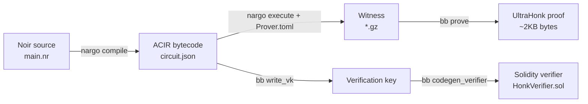
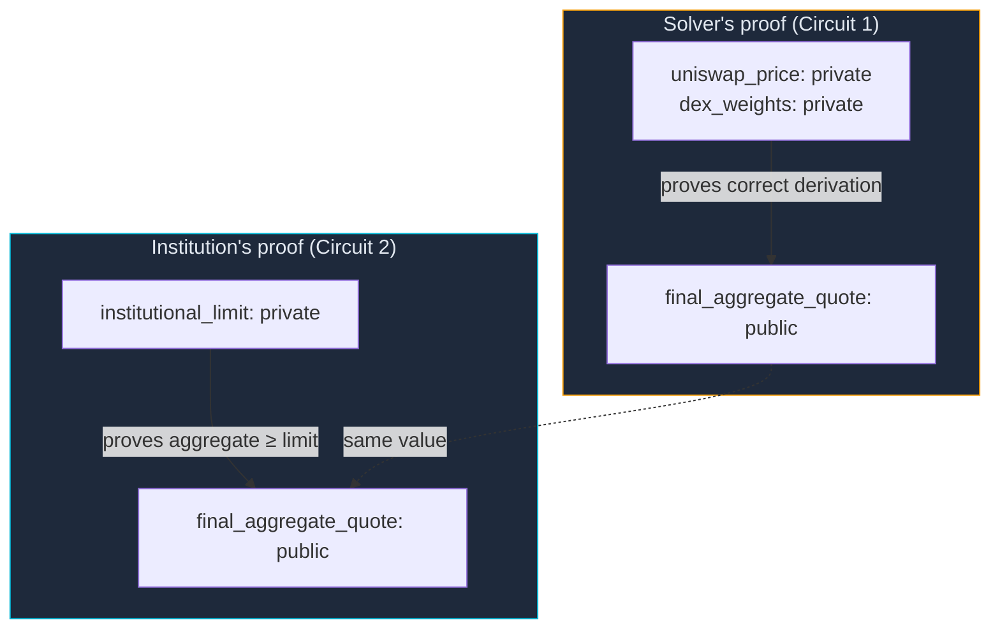
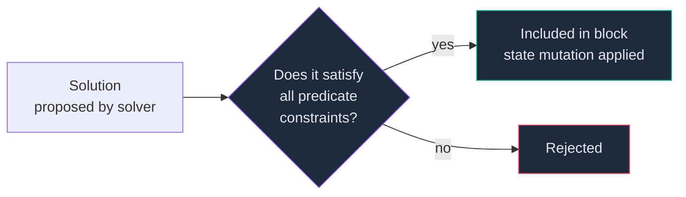
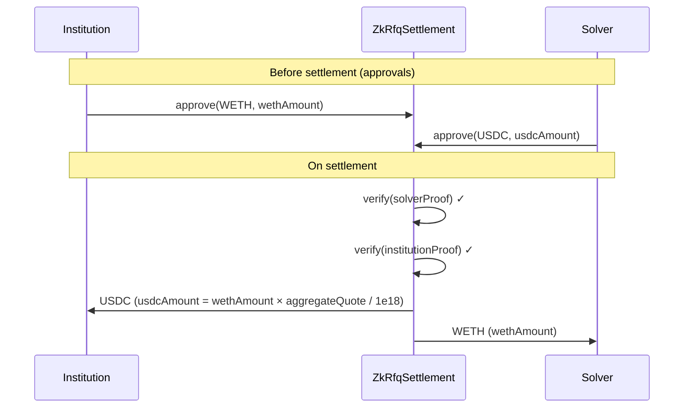
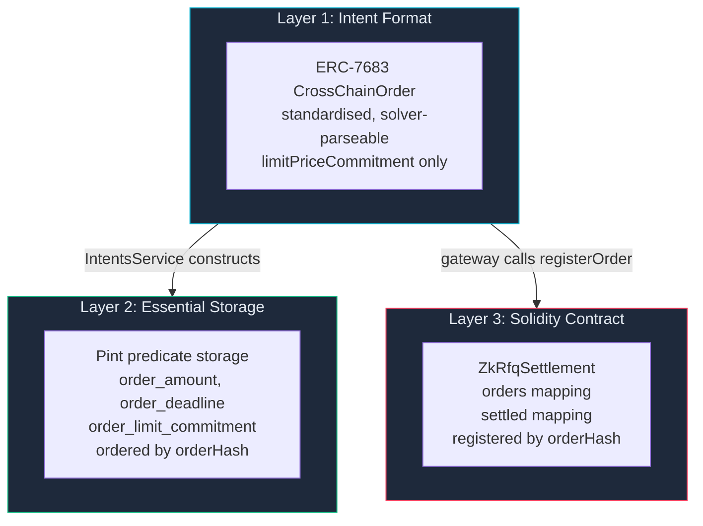
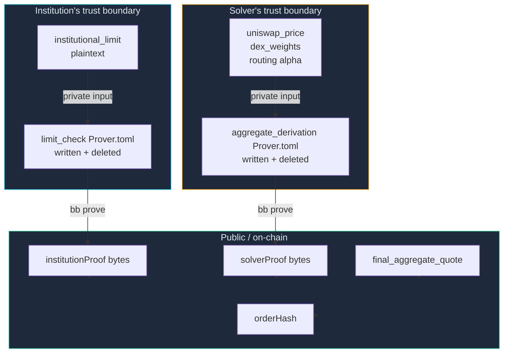
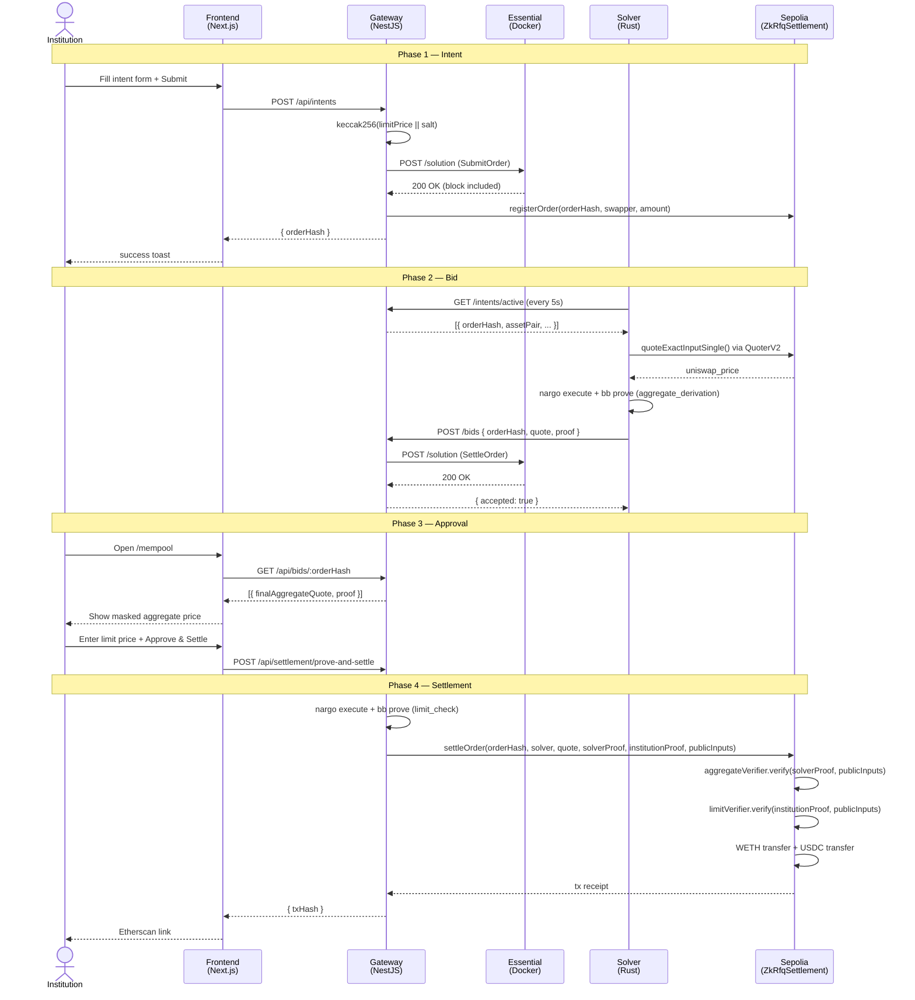

# Concepts & Internal Architecture

> This document explains every technology used in ZK-RFQ from first principles. If you're unfamiliar with zero-knowledge proofs, the Essential protocol, ERC-7683, or how they fit together, start here.

---

## Table of Contents

1. [Zero-Knowledge Proofs](#1-zero-knowledge-proofs)
2. [Noir — The ZK Circuit Language](#2-noir--the-zk-circuit-language)
3. [Barretenberg — The Proof Backend](#3-barretenberg--the-proof-backend)
4. [How the Two-Circuit Design Works](#4-how-the-two-circuit-design-works)
5. [Essential Protocol — Declarative Settlement](#5-essential-protocol--declarative-settlement)
6. [Pint — The Constraint Language](#6-pint--the-constraint-language)
7. [ERC-7683 — Cross-Chain Intents Standard](#7-erc-7683--cross-chain-intents-standard)
8. [The Limit Price Commitment Scheme](#8-the-limit-price-commitment-scheme)
9. [Uniswap V3 QuoterV2 — JIT Pricing](#9-uniswap-v3-quoterv2--jit-pricing)
10. [The Settlement Contract](#10-the-settlement-contract)
11. [How Everything Connects](#11-how-everything-connects)
12. [Glossary](#12-glossary)

---

## 1. Zero-Knowledge Proofs

### What is a ZK proof?

A zero-knowledge proof lets you prove that you know something, or that a statement is true, **without revealing the underlying data**.

A classic analogy: imagine you want to prove to a colourblind friend that two balls are different colours, without revealing which is which. You hand them both balls, turn around, they may or may not swap them, and you tell them whether they swapped. If the balls were identical you'd only guess correctly 50% of the time. After 30 rounds you've guessed correctly 30 times — statistically impossible by luck — and your friend is convinced they're different, even though they still can't see the difference.

A ZK proof in cryptography is the same idea but made mathematical and non-interactive: you generate a single proof object (a blob of bytes) that anyone can verify in milliseconds, without any back-and-forth.

### The three properties

1. **Completeness** — if the statement is true, an honest prover can always generate a valid proof
2. **Soundness** — if the statement is false, a dishonest prover cannot generate a valid proof (except with negligible probability)
3. **Zero-knowledge** — the verifier learns nothing beyond the fact that the statement is true

### What does this mean for ZK-RFQ?

The solver needs to prove: *"I computed this aggregate price honestly from real DEX quotes."*

Without ZK proofs, the solver would have to reveal their routing — which pools they used, at what prices, with what weights. This is their competitive alpha.

With a ZK proof, the solver generates a mathematical proof that their computation was done correctly, and submits just the final number (`final_aggregate_quote`) plus the proof bytes. The on-chain verifier checks the proof in one call. Nobody — not the institution, not the blockchain — sees the solver's private inputs.

Similarly, the institution proves: *"This aggregate price meets my limit."* Their limit price is the private input. The proof is the only thing that goes on-chain.

### Succinct proofs: SNARK vs STARK vs UltraHonk

There are many ZK proof systems. They differ in:
- **Proof size** — how many bytes is the proof?
- **Verification time** — how fast can the verifier check it?
- **Prover time** — how long does it take to generate?
- **Trusted setup** — does a ceremony have to happen first?

ZK-RFQ uses **UltraHonk**, a proof system from Barretenberg. It uses a **polynomial commitment scheme** over a finite field. Proofs are ~2KB and verify in milliseconds on-chain. No trusted setup is required per-circuit.

---

## 2. Noir — The ZK Circuit Language

### What is a circuit?

A ZK proof doesn't prove arbitrary code — it proves the execution of an **arithmetic circuit**: a graph of additions and multiplications over a finite field. Every constraint you write ultimately compiles down to a polynomial equation that the prover must satisfy.

### What is Noir?

[Noir](https://noir-lang.org) is a domain-specific language for writing ZK circuits. It looks like Rust, but compiles to an intermediate representation (ACIR) that Barretenberg can prove.

The key concept: **all values in a Noir circuit are field elements** — integers modulo a large prime (BN254 scalar field, ~254 bits). Regular Rust types like `u64` are emulated by range constraints on field elements.

### Public vs private inputs

```noir
fn main(
    private_value: Field,          // only the prover knows this
    public_result: pub Field,      // verifier and prover both know this
)
```

The `pub` keyword marks a value as a public input. Everything else is a private witness — it exists only in the prover's memory during proof generation. The proof bytes commit to the computation but reveal nothing about private inputs.

### The `aggregate_derivation` circuit (our Circuit 1)

```noir
fn main(
    uniswap_price: Field,          // private
    jupiter_price: Field,          // private (shim: 0 for now)
    dex_weights: [Field; 2],       // private
    final_aggregate_quote: pub Field,  // public
) {
    // C1: weights must sum to 100%
    let weight_sum = dex_weights[0] + dex_weights[1];
    assert(weight_sum == 10000);

    // C2: neither price can be zero
    assert(uniswap_price != 0);
    assert(jupiter_price != 0);

    // C3: aggregate must equal weighted average
    let computed = (uniswap_price * dex_weights[0] + jupiter_price * dex_weights[1]) / 10000;
    assert(computed == final_aggregate_quote);
}
```

When the prover generates a proof, Noir compiles the three `assert` statements into polynomial constraints. Barretenberg finds a witness — an assignment of values to all intermediate variables — that satisfies all constraints simultaneously. The resulting proof is a commitment to that witness.

**The verifier checks:** does the proof commit to a witness that satisfies all constraints AND produces `final_aggregate_quote` as the public output? If yes: valid. If no: invalid. The verifier never sees `uniswap_price`, `jupiter_price`, or `dex_weights`.

### The `limit_check` circuit (our Circuit 2)

```noir
fn main(
    institutional_limit: Field,        // private
    final_aggregate_quote: pub Field,  // public
) {
    let agg = final_aggregate_quote as u64;
    let lim = institutional_limit as u64;
    assert(agg >= lim);
}
```

One constraint: `aggregate >= limit`. If the solver's price is below the institution's floor, the `assert` fails during proof generation — in the browser before anything is sent on-chain. The institution simply doesn't submit.

### Field arithmetic and fixed-point numbers

Noir's `Field` type is an integer modulo a large prime. It has no concept of decimals. We represent prices using **1e6 fixed-point**:

```
$2,492.34 USDC  →  stored as  2492_340000  (integer)
```

Weights use **basis points**:
```
60%  →  6000
100% →  10000
```

This convention is consistent across the Noir circuits, the Rust solver, the gateway, and the Solidity contract.

---

## 3. Barretenberg — The Proof Backend

### What is Barretenberg?

[Barretenberg](https://github.com/AztecNetwork/barretenberg) is a C++ cryptographic library by Aztec that implements the **UltraHonk** proving system. It takes a compiled Noir circuit and a witness, and produces an UltraHonk proof.

It exposes two CLI tools we use:
- **`nargo`** — the Noir compiler and witness generator (`nargo execute` builds the witness from the circuit and a `Prover.toml`)
- **`bb`** — the Barretenberg prover (`bb prove` generates the proof; `bb write_vk` writes the verification key)

### The proof generation pipeline



### Prover.toml

`nargo execute` reads the private inputs from a TOML file:

```toml
# circuits/aggregate_derivation/Prover.toml
uniswap_price = "2493270000"
jupiter_price = "0"
dex_weights = ["10000", "0"]
final_aggregate_quote = "2493270000"
```

The gateway's `NoirProverService` writes this file dynamically before running `nargo execute`, then deletes it. The institution's `institutional_limit` is written the same way and never persisted.

### The Solidity verifier

`bb codegen_verifier` outputs a Solidity contract (`AggregateDerivationVerifier.sol`, `LimitCheckVerifier.sol`) that verifies UltraHonk proofs on-chain. These are deployed alongside `ZkRfqSettlement.sol`. They're deterministic given the circuit — if you recompile the circuit with different constraints, the verifier changes, requiring redeployment.

### Proof sizes

| Property | Value |
|---|---|
| Proof size | ~2KB |
| On-chain verification gas | ~300,000 gas |
| Proof generation time | ~200ms (Apple M2) |
| Verification time | ~5ms |

---

## 4. How the Two-Circuit Design Works

This is the core privacy architecture. It's worth understanding exactly how two separate proofs provide bilateral privacy.

### The fundamental problem

Consider a single-circuit design:

```
single_circuit(
    uniswap_price: private,
    institution_limit: private,    // ← requires the solver to KNOW the limit
    final_quote: public,
)
```

For the solver to generate this proof, they'd need `institution_limit` as an input. That means the limit price has to travel from the institution to the solver. Privacy destroyed.

### The two-circuit solution



Each party proves their own claim with their own private data. The two proofs are linked by sharing the same public value: `final_aggregate_quote`.

On-chain, `ZkRfqSettlement` passes the same `publicInputs = [final_aggregate_quote_as_bytes32]` to both verifiers. Both must pass. If the solver fabricated a different number between proof generation and on-chain submission, `AggregateDerivationVerifier` catches it. If the gateway tried to run `limit_check` with a fake (easier) limit, the proof would verify against a different public value than the solver proved — the on-chain call would supply the real aggregate, and the mismatch would cause `LimitCheckVerifier` to reject.

### What each party learns

| Party | Knows | Never learns |
|---|---|---|
| Solver | `final_aggregate_quote` (from their own circuit), their own routing | Institution's `institutional_limit` |
| Institution | `final_aggregate_quote` (shown in UI) | Solver's `uniswap_price`, `dex_weights`, pool addresses |
| On-chain contract | `final_aggregate_quote`, both proof bytes, `orderHash` | Either party's private inputs |
| Anyone reading the blockchain | Same as contract | Same as contract |

---

## 5. Essential Protocol — Declarative Settlement

### What is Essential?

[Essential](https://essential.builders) is a declarative protocol for building intent-centric applications. Unlike the EVM (where you write imperative Solidity that executes step by step), Essential uses a constraint-based model: you declare what valid terminal states look like, and the protocol's block builder determines whether a proposed state transition satisfies all constraints.

### Imperative vs declarative: a comparison

**EVM / Solidity (imperative):**
```solidity
function settleOrder(bytes32 orderHash, ...) external {
    require(orders[orderHash].active, "not active");
    require(whitelist[msg.sender], "not whitelisted");
    // ... execute logic step by step
    orders[orderHash].active = false;
}
```

You write the execution path. The EVM runs it exactly as written. Bugs in the execution logic (re-entrancy, integer overflow, incorrect ordering) are your problem.

**Essential / Pint (declarative):**
```pint
predicate SettleOrder {
    state is_active: bool = storage::order_is_active[order_hash];
    state whitelisted: bool = storage::solver_whitelisted[solver];

    constraint is_active == true;
    constraint whitelisted == true;
    constraint storage::order_is_active[order_hash]' == false;  // post-state
}
```

You declare what must be true **before** the transition and what must be true **after**. Essential's block builder checks that any proposed solution satisfies all constraints. There's no execution path to exploit — you can't call `settleOrder` and manipulate intermediate state because there is no intermediate state.

### The Essential execution model



A **Solution** is a JSON payload containing:
- Which predicate to satisfy (`predicate_to_solve`)
- Decision variables (the inputs to the predicate)
- State mutations (the storage changes to apply if accepted)

The Essential server validates the solution against the deployed Pint contract, and if all constraints pass, builds it into a block and applies the state mutations atomically.

### Why Essential for ZK-RFQ?

1. **Private intent pool** — Essential is not a public blockchain. Only parties with access to the Essential server see the intents. No public mempool means no front-running on the intent level.
2. **Self-hosted** — the institution runs their own Essential server. They own the infrastructure. No dependency on a third-party protocol.
3. **Built-in solver competition** — Essential's block builder runs an inclusion auction. Multiple solvers can submit competing `SettleOrder` solutions; the one with the better bid wins. No application-level auction logic required.
4. **Atomic constraint validation** — business logic (whitelist, TTL, no-double-settle) is enforced at the protocol level. Application code cannot bypass it.

### Essential vs EVM: when each is used

| Concern | Layer | Why |
|---|---|---|
| Intent storage | Essential | Private, self-hosted, no public mempool |
| Business logic (whitelist, TTL, no-double-settle) | Essential (Pint) | Declarative, protocol-enforced, no execution bugs |
| ZK proof verification | Sepolia (EVM) | On-chain verifiability = cryptographic audit trail |
| Token transfers | Sepolia (EVM) | ERC-20 tokens live on Ethereum; atomic transfers require the same chain |

---

## 6. Pint — The Constraint Language

Pint is Essential's domain-specific language. Think of it as a type-safe constraint specification language, not a programming language.

### Storage declarations

```pint
storage {
    order_is_active:   ( b256 => bool ),  // map: orderHash -> active?
    order_amount:      ( b256 => int  ),  // map: orderHash -> amount
    solver_whitelisted: ( b256 => bool ), // map: solverAddress -> whitelisted?
}
```

This defines what data lives on-chain (on Essential). No getter/setter functions — you just declare the storage schema.

### Pre-state reads

```pint
predicate SettleOrder {
    var order_hash: b256;
    var solver: b256;

    state is_active: bool = storage::order_is_active[order_hash];
    state whitelisted: bool = storage::solver_whitelisted[solver];
```

`state` reads the **current** value of storage. These are the pre-conditions.

### Post-state constraints

```pint
    constraint storage::order_is_active[order_hash]' == false;
```

The `'` suffix (prime) refers to the **post-state** — what storage must look like after the mutation is applied. This is how Essential knows what state transitions to permit.

### Decision variables

```pint
    var aggregate_quote: int;
    var proof_verified: bool;
```

Decision variables are the inputs provided by the solver in the Solution payload. They're not read from storage — they're provided at solution time and checked against constraints.

### Constraint satisfaction

Every `constraint` statement must evaluate to `true` for the solution to be valid. If any constraint fails, the entire solution is rejected atomically — no partial state mutation.

---

## 7. ERC-7683 — Cross-Chain Intents Standard

### What is ERC-7683?

[ERC-7683](https://eips.ethereum.org/EIPS/eip-7683) is an emerging Ethereum standard that defines a universal format for expressing cross-chain trade intents. The core idea: instead of routing your order through a specific protocol, you declare *what you want* (swap 1 WETH for at least 2400 USDC) and let any solver fill it.

### The CrossChainOrder struct

```typescript
interface CrossChainOrder {
    settlementContract: string;  // contract that will verify + execute the fill
    swapper: string;             // institution's address
    nonce: bigint;               // replay protection
    originChainId: number;       // where the input tokens are
    fillDeadline: number;        // unix timestamp — order expires after this
    orderData: RfqOrderData;     // application-layer payload (ZK-RFQ specific)
    inputs: Input[];             // what the institution gives up
    outputs: Output[];           // what the institution receives
}
```

### Why use a standard?

Without ERC-7683, every intent protocol has its own API. A solver integrates with Protocol A, Protocol B, and Protocol C separately. With ERC-7683, a solver that supports any ERC-7683 system can parse all of them. This creates a competitive market: more solvers → better prices for the institution.

### How ZK-RFQ extends it

The base `CrossChainOrder` knows nothing about ZK proofs. We extend it via `orderData: RfqOrderData`:

```typescript
interface RfqOrderData {
    assetPair: string;               // "WETH/USDC"
    limitPriceCommitment: string;    // keccak256(limitPrice || salt) — NOT the price
    zkMaskApplied: boolean;          // confirms ZK routing mask was applied
    // ...
}
```

The `limitPriceCommitment` is the privacy-critical addition. Instead of storing the limit price, we store a cryptographic commitment to it (see Section 8). Solvers can read the entire `CrossChainOrder` and still learn nothing about the institution's floor price.

### The orderHash

```typescript
// gateway/src/types/erc7683.ts
function hashCrossChainOrder(order: CrossChainOrder): string {
    const encoded = abiCoder.encode([...], [...]);
    return keccak256(encoded);
}
```

The `orderHash` is the keccak256 of the ABI-encoded order fields. It's the primary key used everywhere: Essential storage, the Solidity contract, solver bids. It uniquely identifies the trade intent.

---

## 8. The Limit Price Commitment Scheme

### The problem

The institution's limit price is sensitive — it's the maximum they'd pay. If solvers could read it from the blockchain, they'd always quote exactly at the limit (not better), extracting maximum value. We need to prove the limit exists and was met without revealing what it is.

### Hash commitments

A **cryptographic commitment** is a two-phase scheme:

1. **Commit phase:** compute `commitment = hash(secret || salt)` and publish `commitment`
2. **Reveal phase:** later reveal `(secret, salt)` — anyone can verify `hash(secret || salt) == commitment`

Properties:
- **Hiding:** `commitment` reveals nothing about `secret` (hash is one-way)
- **Binding:** you can't find a different `secret'` such that `hash(secret' || salt) == commitment` (collision resistance)

### How ZK-RFQ uses it

```typescript
// IntentsService.submitIntent()
const salt = randomBytes(32);
const limitPriceCommitment = createHash('sha256')
    .update(dto.limitPrice)
    .update(salt)
    .digest('hex');
```

The `limitPriceCommitment` is stored in Essential storage and in the `CrossChainOrder.orderData`. The plaintext `limitPrice` and `salt` are discarded after the commitment is computed — they're never stored anywhere.

Later, when the institution approves a bid, they provide `institutionLimit` to `POST /settlement/prove-and-settle`. The gateway uses this as the private Noir witness. The ZK proof then proves `aggregate >= institutionLimit` without revealing `institutionLimit`.

**Why not just check `aggregate >= commitment`?** Because you can't compare a hash to a number. The commitment proves the limit was fixed at submission time (preventing the institution from retroactively changing it). The ZK proof proves the limit was met without revealing what it is.

---

## 9. Uniswap V3 QuoterV2 — JIT Pricing

### What is Uniswap V3?

Uniswap V3 is an automated market maker (AMM) on Ethereum. Instead of a traditional order book, liquidity is provided in price ranges (concentrated liquidity positions). The price of a swap is determined by a constant product formula over the active liquidity range.

### QuoterV2

`QuoterV2` is a Uniswap V3 utility contract that simulates a swap and returns the expected output — without actually executing the swap. It's used for pricing only.

```solidity
interface IQuoterV2 {
    function quoteExactInputSingle(
        address tokenIn,
        address tokenOut,
        uint24 fee,
        uint256 amountIn,
        uint160 sqrtPriceLimitX96
    ) external returns (
        uint256 amountOut,
        uint160 sqrtPriceX96After,
        uint32 initializedTicksCrossed,
        uint256 gasEstimate
    );
}
```

### How the Rust solver uses it

```rust
// solver/src/uniswap_quoter.rs
// Call QuoterV2 on Sepolia using Alloy
let quote = quoter.quoteExactInputSingle(
    weth_address,    // tokenIn
    usdc_address,    // tokenOut
    3000,            // 0.3% fee tier
    1e18 as u256,    // 1 WETH in
    0,               // no price limit
).call().await?;

// amountOut is in USDC (6 decimals)
// Convert to 1e6 fixed-point for the Noir circuit
let price_micro = quote.amountOut; // already in USDC micros
```

### Why JIT (Just-In-Time) pricing?

JIT means the price is fetched at the moment the solver responds to a specific intent — not cached. This gives the institution the most current market price, prevents stale quotes, and is a freshness requirement enforced by `bidExpiry` in the bid payload.

### The Sepolia pool

On Sepolia, there's no real WETH/USDC liquidity. The deploy script runs `SetupPool.s.sol` which creates a Uniswap V3 pool for MockWETH/MockUSDC at an initial price and seeds it with liquidity. The `UNISWAP_POOL_ADDRESS` and `QUOTER_V2_ADDRESS` from the deploy output are wired into the solver's config.

---

## 10. The Settlement Contract

### `ZkRfqSettlement.sol` — what it does

The settlement contract is the trust anchor of the entire system. It's the only component that holds both parties accountable simultaneously: the solver proves their price is honest; the institution proves their limit was met; the contract verifies both and executes atomically.

### Token flow



Both `safeTransferFrom` calls happen in the same transaction inside `nonReentrant`. If either transfer fails, the entire transaction reverts — there's no state where one party receives their tokens and the other doesn't.

### The USDC amount calculation

```solidity
// wethAmount: 18 decimals (1 WETH = 1e18)
// aggregateQuote: 1e6 fixed-point (2492.34 USDC = 2492_340000)
// usdcAmount: 6 decimals (2492.34 USDC = 2492_340000)

uint256 usdcAmount = (wethAmount * aggregateQuote) / 1e18;
```

Example:
```
wethAmount     = 1_000000000000000000  (1 WETH in wei)
aggregateQuote = 2492_340000           ($2492.34 in 1e6)
usdcAmount     = 1e18 * 2492340000 / 1e18 = 2492340000  (= $2492.34 USDC)
```

### Replay protection

```solidity
mapping(bytes32 => bool) public settled;

require(!settled[orderHash], "Order already settled");
// ...
settled[orderHash] = true;
```

Once settled, the `orderHash` can never be settled again. This prevents an attacker who intercepts the proof bytes from replaying the settlement transaction.

### Immutable verifiers

```solidity
INoirVerifier public immutable aggregateVerifier;
INoirVerifier public immutable limitVerifier;
```

The verifier addresses are set at construction and cannot be changed. This is a deliberate security choice: if someone could change the verifier to an always-true contract, they could bypass proof verification. The tradeoff is that a circuit upgrade requires redeploying the entire settlement contract.

---

## 11. How Everything Connects

This section walks through the exact path a single trade takes through every component.

### The intent object travels through layers



The same `orderHash` (keccak256 of the ERC-7683 order) is the primary key in both Essential storage and the Solidity contract's `orders` mapping. This creates a consistent identifier across all layers.

### Privacy boundaries



The proof bytes can be inspected by anyone — they're on the blockchain. But they're cryptographically opaque: extracting `institutional_limit` or `uniswap_price` from proof bytes is computationally equivalent to breaking the hash function and the polynomial commitment scheme simultaneously. In practice: impossible.

### The gateway as orchestrator

The gateway is a trusted orchestrator — it holds the settler wallet private key, calls the Essential server, generates the `limit_check` proof, and calls `settleOrder`. It is a point of trust in the current architecture (it could see `institutionLimit` since it generates the proof). The production fix is client-side proof generation, which removes the gateway from the institution's trust model entirely.

### End-to-end message flow



---

## 12. Glossary

| Term | Definition |
|---|---|
| **ACIR** | Arithmetic Circuit Intermediate Representation — the bytecode format that Noir compiles to before Barretenberg proves it |
| **Aggregate quote** | The final price the solver commits to, computed from weighted DEX prices. The only public output of the `aggregate_derivation` circuit. |
| **Barretenberg** | C++ cryptographic library by Aztec implementing UltraHonk proof system. Exposed via `bb` CLI. |
| **Basis points (bps)** | Unit for percentages in financial context. 1 bps = 0.01%, 10000 bps = 100%. Used for routing weights. |
| **Block builder** | The component in Essential that validates solutions against Pint predicates and builds them into blocks. Analogous to a block proposer on Ethereum but with constraint validation built in. |
| **Commitment** | `hash(secret || salt)` — proves a value was fixed at a point in time without revealing it |
| **CrossChainOrder** | The ERC-7683 struct that encodes a trade intent. Primary unit of communication between gateway and solvers. |
| **Decision variables** | In Pint: the inputs provided by the solver in a Solution payload. Checked against constraints but not read from storage. |
| **ERC-7683** | Ethereum standard for cross-chain intents. Defines `CrossChainOrder` struct and solver interface. |
| **Essential** | A declarative intent protocol. Uses Pint constraints for settlement logic instead of imperative Solidity. |
| **Field element** | An integer modulo a large prime (BN254 curve scalar field, ~254 bits). All values in Noir circuits are field elements. |
| **Fixed-point** | A way to represent decimals as integers by multiplying by a scale factor. We use 1e6 (multiply by 1,000,000). |
| **JIT pricing** | Just-in-time: price fetched at the exact moment of quoting, not cached. Ensures freshness. |
| **Limit price commitment** | `keccak256(limitPrice || salt)` stored in the intent. Proves the limit was fixed at submission without revealing its value. |
| **Nargo** | The Noir compiler and witness generator CLI tool. `nargo execute` writes the witness file consumed by `bb prove`. |
| **Noir** | Domain-specific language for writing ZK circuits, by Aztec. Looks like Rust, compiles to ACIR. |
| **orderHash** | keccak256 of the ABI-encoded `CrossChainOrder`. Primary key across Essential storage, Solidity contract, solver bids. |
| **Pint** | Essential's declarative constraint language. You declare valid state transitions; the block builder checks them. |
| **Post-state** | In Pint: storage values after the solution's mutations are applied. Written with the `'` (prime) suffix. |
| **Pre-state** | In Pint: storage values before the solution runs. Read with `state` declarations. |
| **Private witness** | In a ZK circuit: an input that the prover knows but the verifier never sees. Contributes to the proof without being revealed. |
| **Proof bytes** | The opaque byte blob output of `bb prove`. Approximately 2KB. Can be verified by anyone holding the verification key or deployed on-chain. |
| **Public input** | A circuit value that both prover and verifier know. Marked `pub` in Noir. The verifier checks that the proof commits to the stated public input. |
| **QuoterV2** | Uniswap V3 simulation contract. Returns the expected output of a swap without executing it. Used for JIT pricing. |
| **Replay protection** | `settled[orderHash] = true` in the Solidity contract. Prevents re-using a valid proof to settle the same order twice. |
| **SNARK** | Succinct Non-interactive ARgument of Knowledge. General term for proof systems that produce small, fast-to-verify proofs. UltraHonk is one variant. |
| **Solution** | In Essential: a JSON payload proposing a state transition. Contains decision variables and state mutations. Validated against predicates before block inclusion. |
| **UltraHonk** | Barretenberg's proof system. No trusted setup, ~2KB proofs, ~300k gas to verify on-chain. |
| **Verification key (VK)** | A deterministic artifact derived from the compiled circuit. Used by the Solidity verifier to check proofs. Changing the circuit changes the VK and requires redeployment. |
