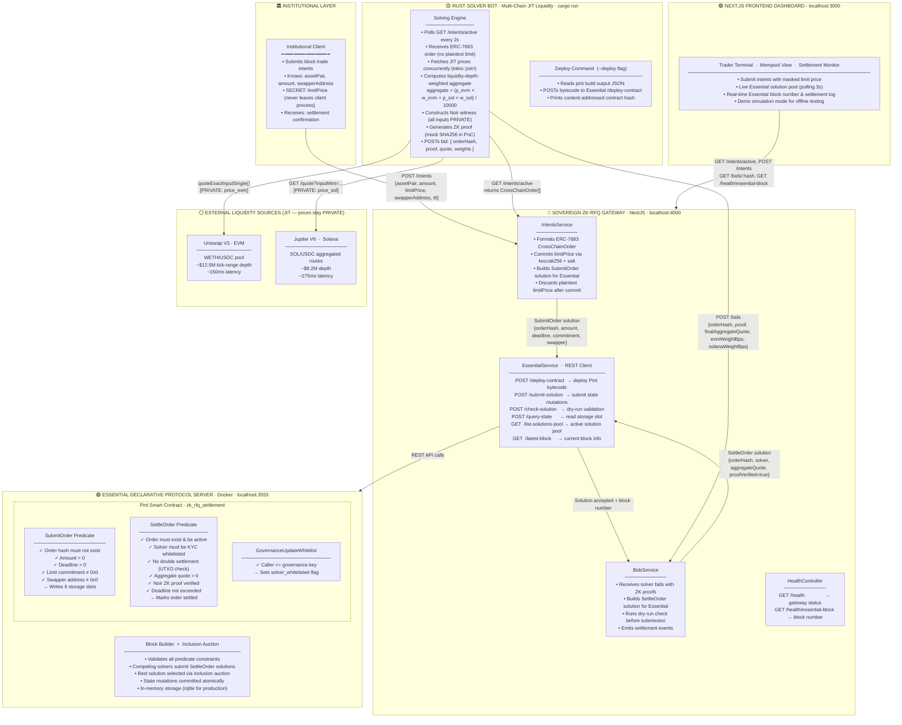
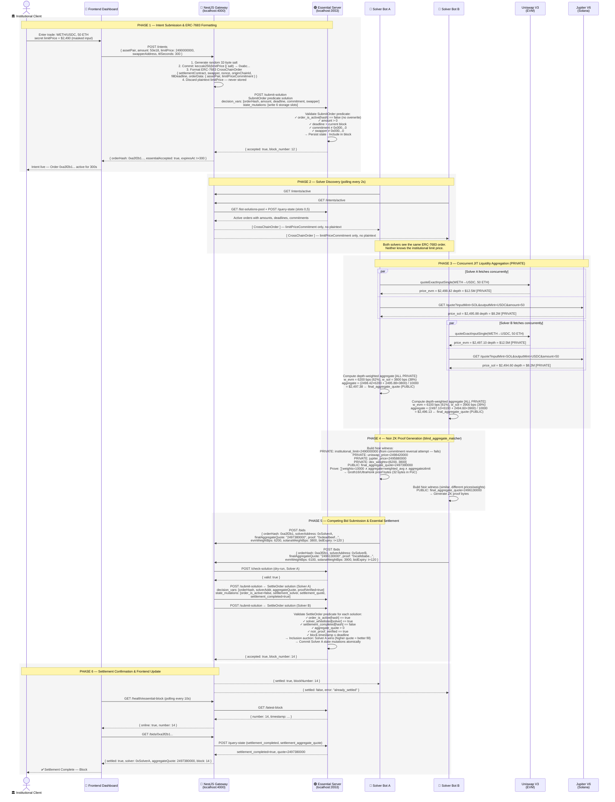

# ZK-RFQ Sovereign Gateway

## A 100% Self-Hosted, Zero-Knowledge Request-for-Quote Gateway for Institutional Block Trading

---

> **Abstract.** Institutional block trading on public decentralised exchanges suffers from an irresolvable trilemma: obtaining sufficient liquidity requires signalling trade intent, signalling intent causes alpha leakage, and avoiding leakage restricts the available liquidity pool. This repository presents a Proof of Concept (PoC) of a _Sovereign ZK-RFQ Gateway_ that resolves this trilemma through the simultaneous application of three independently powerful primitives: (1) **ERC-7683 intent standardisation** for plug-and-play global market maker interoperability, (2) **multi-chain Just-In-Time (JIT) liquidity aggregation** across EVM and Solana networks by whitelisted solvers, and (3) **Noir zero-knowledge proof generation** for aggregate price attestation without disclosure of individual DEX routes, pool addresses, or the institution's limit price. Settlement is executed on 100% sovereign, self-hosted infrastructure — the Essential declarative protocol server running native Pint smart contracts — demonstrating that institutions need not depend on any public third-party network at any stage of the trade lifecycle.

---

## Table of Contents

1. [The Institutional Trilemma](#1-the-institutional-trilemma)
2. [Architecture Overview](#2-architecture-overview)
3. [ERC-7683 Intent Standardisation](#3-erc-7683-intent-standardisation)
4. [Multi-Chain JIT Liquidity Aggregation](#4-multi-chain-jit-liquidity-aggregation)
5. [ZK Aggregate Price Masking (Noir)](#5-zk-aggregate-price-masking-noir)
6. [Sovereign Execution (Essential Declarative Protocol)](#6-sovereign-execution-essential-declarative-protocol)
7. [Repository Structure](#7-repository-structure)
8. [Setup & Running Locally](#8-setup--running-locally)
9. [Component Interaction Diagram](#9-component-interaction-diagram)
10. [Security Considerations](#10-security-considerations)
11. [Limitations & Future Work](#11-limitations--future-work)
12. [References](#12-references)

---

## 1. The Institutional Trilemma

### 1.1 Background

The emergence of on-chain decentralised liquidity for large-notional block trades represents one of the most consequential shifts in institutional market microstructure since the advent of electronic dark pools. However, the transition from permissioned OTC voice-trading to permissionless on-chain execution introduces a fundamental three-way conflict that existing solutions fail to resolve:

```
                         ┌──────────────┐
                         │  LIQUIDITY   │
                         │  (access to  │
                         │  deep pools) │
                         └──────┬───────┘
                               / \
                              /   \
                             /     \
         ┌─────────────────┴──┐ ┌──┴──────────────────┐
         │  ALPHA PROTECTION  │ │    COMPLIANCE         │
         │  (no front-running,│ │   (KYC/AML, audit    │
         │   no info leakage) │ │    trail, reporting)  │
         └────────────────────┘ └───────────────────────┘
```

_The Institutional Trilemma:_ An institution can optimise for at most two of these three properties simultaneously using existing infrastructure.

### 1.2 The Three Failure Modes

**Failure Mode A — Liquidity + Compliance, No Alpha Protection.**
Posting a large limit order to a public mempool (or even a permissioned RFQ platform with many participants) exposes the institution's hand to the market. Sophisticated high-frequency traders observe the order, update their models, and adjust quoted prices accordingly before the fill completes. For a 10,000 ETH block trade, this information leakage ("alpha decay") can cost hundreds of basis points in market impact.

**Failure Mode B — Alpha Protection + Compliance, No Liquidity.**
The institution restricts its order to a single, pre-vetted OTC counterparty. While this eliminates information leakage, it sacrifices competitive price discovery. The single counterparty captures the entire bid-ask spread and has no incentive to offer best execution. Execution quality is thus a function of bilateral negotiating power rather than market efficiency.

**Failure Mode C — Liquidity + Alpha Protection, No Compliance.**
Some dark pool solutions offer information barriers but rely on unregulated, off-shore order matching infrastructure. Institutions subject to MiFID II, FINRA 4370, or equivalent frameworks cannot use such venues without violating their own compliance charters, regardless of execution quality.

### 1.3 The ZK-RFQ Solution

This gateway resolves all three failure modes simultaneously:

- **Liquidity:** ERC-7683 intents are readable by _any_ globally whitelisted solver, aggregating EVM and Solana liquidity JIT without broadcasting the institution's limit price.
- **Alpha Protection:** The Noir ZK circuit proves price quality without revealing the limit price, DEX-specific prices, or routing weights. The institution's strategic information is a private zero-knowledge witness — by mathematical construction, it cannot be extracted.
- **Compliance:** All infrastructure is self-hosted. The sovereign Essential server, NestJS gateway, and Pint smart contracts maintain a complete audit trail without any external data dependencies. KYC/AML is enforced at the solver whitelist entry point, not at settlement time.

---

## 2. Architecture Overview

The system comprises five independent, composable components that interact via well-defined interfaces:



---

## 3. ERC-7683 Intent Standardisation

### 3.1 Motivation

Before ERC-7683, each cross-chain liquidity protocol (Across, Uniswap X, Stargate, deBridge, etc.) defined its own proprietary order format. A solver wishing to fill orders across venues needed to implement N separate integrations — a high engineering cost that effectively restricted liquidity provision to well-resourced teams. The result was a fragmented, oligopolistic solver market: exactly the kind of environment that produces anti-competitive spread capture at the institution's expense.

ERC-7683 ("Cross-Chain Intents") defines a universal `CrossChainOrder` struct that any solver can parse:

```typescript
interface CrossChainOrder {
  settlementContract: string; // origin chain settlement hook
  swapper: string; // institutional client address
  nonce: bigint; // replay protection
  originChainId: number; // chain holding input tokens
  initiateDeadline: number; // latest valid open timestamp
  fillDeadline: number; // fill deadline (after = stale)
  orderData: RfqOrderData; // app-specific payload (ABI-encoded)
  inputs: Input[]; // what institution commits
  outputs: Output[]; // what solver must deliver
}
```

### 3.2 Privacy-Preserving Extension

The `RfqOrderData` in this gateway extends the standard with a `limitPriceCommitment` field:

```typescript
limitPriceCommitment = keccak256(abi.encode(limitPrice, salt));
```

The `limitPrice` and `salt` are _never stored_ by the gateway — only the commitment hash. The actual limit price travels exclusively as a private Noir witness input, mathematically binding it to the ZK proof without any on-chain or off-chain disclosure.

### 3.3 Network Effects of Standardisation

By adopting ERC-7683, this gateway becomes interoperable with any solver that implements the standard, including future solvers not yet written. This "plug-and-play" property is crucial: the institution trades the benefit of attracting the broadest possible competitive market-making community against the cost of revealing only the minimum viable information (asset pair, amount, deadline).

---

## 4. Multi-Chain JIT Liquidity Aggregation

### 4.1 The Problem with Single-Chain Execution

A 10,000 ETH block trade ($24.9M at $2,490/ETH) would exhaust the tick-range liquidity in most Uniswap V3 WETH/USDC pool configurations, pushing the marginal price materially above the fair value. The implied slippage on a single Uniswap pool for this trade size could be 30–80 basis points, representing $75K–$200K in cost.

### 4.2 JIT Cross-Chain Aggregation

The solver bot queries both chains _concurrently_ to minimise JIT latency:

```
Uniswap V3 (EVM)  ──── price: $2,498.42 ──── depth: $12.5M ──┐
                                                                 ├── weighted avg ── $2,497.38
Jupiter (Solana)  ──── price: $2,495.88 ──── depth: $8.2M  ──┘
                    ↕                          ↕
              [400ms latency]          [600ms latency]
              [PRIVATE: pool info]    [PRIVATE: AMM routes]
```

**Weight determination** is liquidity-depth-weighted with a price bias:

- A chain offering deeper tick-range liquidity receives higher weight.
- A chain offering a better price receives a bonus allocation.
- Weights are constrained to sum to 10,000 bps (100%) within the Noir circuit.

### 4.3 No Bridging Risk

Crucially, the institution does not bridge assets. The solver — who has pre-positioned inventory on both chains as part of its market-making operations — absorbs the cross-chain logistics. The institution's input tokens and output tokens both reside on the origin chain (or a pre-agreed destination chain). The solver arbitrages its own multi-chain positions to fill the order, bearing the bridging and rebalancing risk as part of its market-making cost structure.

This is fundamentally different from "bridge-and-swap" approaches where the institution takes on smart contract risk on both the bridging protocol and the destination chain DEX.

---

## 5. ZK Aggregate Price Masking (Noir)

### 5.1 The Information-Theoretic Problem

In a standard RFQ system, the solver must receive the institution's limit price to determine whether its fill is profitable. But receiving the limit price in plaintext gives the solver an **information advantage**: it can quote exactly one tick above the limit (extracting maximum consumer surplus) rather than competing to offer the best possible price.

More critically, if the solver's response is observable to third parties (e.g., transaction mempool observers), revealing the limit price enables front-running by those parties before settlement.

### 5.2 The Noir Circuit: `blind_aggregate_matcher`

The circuit in `circuits/src/main.nr` solves this by allowing the solver to prove:

> _"I have computed an aggregate price from real DEX sources that is (a) correctly derived from those sources with valid weights, and (b) at least as good as the institution's limit — without revealing the individual DEX prices, the routing weights, or the limit price itself."_

**Witness Layout:**

| Input                   | Visibility  | Description                                              |
| ----------------------- | ----------- | -------------------------------------------------------- |
| `institutional_limit`   | **Private** | Institution's minimum acceptable price (fixed-point 1e6) |
| `uniswap_price`         | **Private** | EVM DEX spot price at quote time                         |
| `jupiter_price`         | **Private** | Solana DEX price at quote time                           |
| `dex_weights[2]`        | **Private** | [EVM bps, Solana bps] routing allocation                 |
| `final_aggregate_quote` | **Public**  | Composite price attested by the solver                   |

**Constraints Enforced:**

```noir
// C1: Weight integrity — prevents phantom routing
assert(dex_weights[0] + dex_weights[1] == 10000);

// C2: Price sanity — rejects failed JIT fetches
assert(uniswap_price != 0);
assert(jupiter_price != 0);

// C3: Accurate derivation — solver cannot fabricate quote
let computed = (uniswap_price * dex_weights[0] + jupiter_price * dex_weights[1]) / 10000;
assert(computed == final_aggregate_quote);

// C4: Price threshold — core execution guarantee
assert(final_aggregate_quote >= institutional_limit);
```

### 5.3 Proof System Properties

The generated proof (Groth16 or UltraHonk, configurable in `Nargo.toml`) has the following properties relevant to the block trading use case:

- **Soundness:** No PPT adversary can produce a valid proof for a false statement (e.g., a fabricated aggregate price) without knowing the actual satisfying witnesses.
- **Zero-Knowledge:** The verifier (Essential predicate) gains no information about the private witnesses beyond what is implied by the public input being valid.
- **Succinctness:** Proof size is O(1) in the complexity of the underlying computation.
- **Non-interactivity:** The proof is a single message from solver to verifier — no challenge-response round trips that would introduce latency risk before settlement.

---

## 6. Sovereign Execution (Essential Declarative Protocol)

### 6.1 Why "Sovereign"?

The term "sovereign" in this context refers to infrastructure that is **fully under the institution's operational control** at all times — no dependency on public validators, third-party RPC providers, or shared mempool infrastructure. The relevance is both operational (a public chain RPC outage cannot halt institutional settlement) and regulatory (the institution can demonstrate full custody of the settlement process to regulators).

This PoC demonstrates sovereignty using 100% local infrastructure:

- **Essential Server:** Local declarative protocol server (Docker container with in-memory storage)
- **Pint Smart Contracts:** Declarative predicates defining valid settlement states
- **NestJS Gateway:** Locally deployed intent management and Essential API client

### 6.2 The Essential Declarative Model

[Essential](https://essential.builders) is an intent-centric settlement layer built on a _declarative_ model rather than the imperative EVM model. Key architectural differences:

| Dimension          | EVM (Solidity)              | Essential (Pint)                   |
| ------------------ | --------------------------- | ---------------------------------- |
| Execution paradigm | Imperative (HOW to compute) | Declarative (WHAT state is valid)  |
| Transaction model  | Account-based messages      | UTXO-like solutions to predicates  |
| Mutable state      | Gas-metered opcodes         | Constraint-validated state diffs   |
| Settlement actors  | Miners/validators           | Solvers propose, network validates |

### 6.3 Pint Contract — `zk_rfq_settlement`

The Pint contract at `predicates/src/contract.pnt` defines **three declarative predicates** that specify the VALID terminal states of the RFQ lifecycle:

**Predicate 1: `SubmitOrder`** — Intent submission
- Validates that a new order hash does not already exist
- Enforces non-zero amount, deadline, limit commitment, and swapper address
- Atomically writes all order fields to Essential storage

**Predicate 2: `SettleOrder`** — Solver settlement
- Validates solver is whitelisted (KYC/AML enforcement point)
- Prevents double settlement (UTXO-style spent-state check)
- Requires positive aggregate quote and verified Noir proof
- Atomically marks order as settled and records the winning solver

**Predicate 3: `GovernanceUpdateWhitelist`** — Solver governance
- Only the governance key holder can whitelist or remove solvers
- Provides the institutional compliance team with solver access control

**Storage Layout:**

| Slot | Key Type      | Value   | Description                       |
| ---- | ------------- | ------- | --------------------------------- |
| 0    | b256 → int    | amount  | Token amount in base units        |
| 1    | b256 → int    | int     | Fill deadline (Unix timestamp)    |
| 2    | b256 → b256   | hash    | keccak256(limitPrice \|\| salt)   |
| 3    | b256 → b256   | address | Institutional swapper address     |
| 4    | b256 → int    | enum    | Encoded asset pair identifier     |
| 5    | b256 → bool   | flag    | Order active / inactive           |
| 6    | b256 → b256   | address | Winning solver address             |
| 7    | b256 → int    | price   | Settlement aggregate quote        |
| 8    | b256 → int    | number  | Block number of settlement        |
| 9    | b256 → bool   | flag    | Settlement finality               |
| 10   | b256 → bool   | flag    | Solver KYC whitelist status       |
| 11   | b256          | address | Governance key                    |

In a declarative system, solvers propose _solutions_ that satisfy these predicates. The Essential block builder validates all constraints and includes the solution in a block only if every predicate evaluates to `true`. This is fundamentally different from imperative execution: the solver declares the desired end state, and the network validates it, rather than executing a sequence of opcodes.

### 6.4 Essential REST API

The gateway communicates with the Essential server via a REST API:

| Endpoint              | Method | Purpose                                |
| --------------------- | ------ | -------------------------------------- |
| `/health`             | GET    | Connection health check                |
| `/deploy-contract`    | POST   | Deploy compiled Pint contract          |
| `/submit-solution`    | POST   | Submit a solution for block inclusion  |
| `/check-solution`     | POST   | Dry-run validation (pre-submission)    |
| `/query-state`        | POST   | Read a storage slot by key             |
| `/list-solutions-pool`| GET    | View pending solutions (mempool)       |
| `/latest-block`       | GET    | Get the most recent block              |
| `/list-blocks`        | GET    | List recent blocks with solutions      |

---

## 7. Repository Structure

```text
zk-rfq-gateway/
├── circuits/
│   ├── Nargo.toml                    # Noir project manifest
│   └── src/
│       └── main.nr                   # Blind Aggregate Matcher ZK circuit
├── predicates/
│   ├── pint.toml                     # Pint project manifest
│   └── src/
│       └── contract.pnt              # Declarative settlement predicates
├── gateway/                          # NestJS sovereign gateway
│   ├── package.json
│   ├── tsconfig.json
│   ├── .env                          # Essential server config
│   └── src/
│       ├── main.ts                   # NestJS bootstrap
│       ├── app.module.ts             # Root module
│       ├── dto/gateway.dto.ts        # Request DTOs (class-validator)
│       ├── types/erc7683.ts          # ERC-7683 type definitions
│       ├── essential/
│       │   ├── essential.module.ts   # Global Essential client module
│       │   └── essential.service.ts  # Essential REST API client
│       ├── health/
│       │   └── health.controller.ts  # Health + Essential block endpoint
│       ├── intents/
│       │   ├── intents.controller.ts # POST /intents, GET /intents/active
│       │   ├── intents.service.ts    # ERC-7683 formatting, SubmitOrder
│       │   └── intents.module.ts
│       └── bids/
│           ├── bids.controller.ts    # POST /bids, GET /bids/:hash
│           ├── bids.service.ts       # SettleOrder solution construction
│           └── bids.module.ts
├── solver/                           # Rust multi-chain solver bot
│   ├── Cargo.toml
│   └── src/
│       └── main.rs                   # JIT aggregation + Noir proof + bid
├── scripts/
│   └── mock_multi_chain_solver.ts    # TypeScript solver (dev convenience)
├── frontend/                         # Next.js 14 dashboard
│   ├── pages/
│   │   ├── index.tsx                 # Landing / overview page
│   │   ├── terminal.tsx              # Institutional trader terminal
│   │   ├── mempool.tsx               # Live Essential solution pool view
│   │   ├── settlement.tsx            # Essential settlement monitor
│   │   └── api/[...path].ts          # Gateway API proxy
│   ├── styles/globals.css            # Glassmorphism design system
│   └── tailwind.config.js
├── docker-compose.yml                # Essential server + gateway containers
├── Dockerfile.essential              # Essential REST server build
├── package.json                      # Root workspace
├── tsconfig.json                     # Root TypeScript config
└── README.md
```

---

## 8. Setup & Running Locally

### Prerequisites

| Tool             | Version   | Purpose                             | Required |
| ---------------- | --------- | ----------------------------------- | -------- |
| Node.js          | >= 20.x   | Runtime                             | ✅ Yes   |
| npm              | >= 10.x   | Package management                  | ✅ Yes   |
| Docker           | >= 24.x   | Essential server container          | ✅ Yes   |
| Rust / Cargo     | >= 1.79   | Solver bot compilation              | ✅ Yes   |
| Pint             | latest    | Pint contract compilation           | ⚠️ For contract deploy |
| Nargo            | >= 0.30.0 | Real Noir proof generation          | Optional |

**Install Rust** (if not already installed):
```bash
curl --proto '=https' --tlsv1.2 -sSf https://sh.rustup.rs | sh
source ~/.cargo/env
```

**Install Pint** (required to compile and deploy the smart contract):
```bash
cargo install pint-cli
# Verify: pint --version
```

### Step 1: Install Dependencies

Run all three installs from the project root:

```bash
# Root workspace
npm install

# NestJS Gateway
cd gateway && npm install && cd ..

# Next.js Frontend
cd frontend && npm install && cd ..
```

The Rust solver compiles on demand — no separate install step needed.

### Step 2: Start the Essential Server

```bash
# Start Essential server via Docker (port 3553)
npm run essential:up

# Watch startup logs to confirm it is listening
npm run essential:logs
# Look for: "Listening on: 0.0.0.0:3553"

# Alternatively, check the container is running
docker ps | grep essential
```

> **Note:** The Essential REST server does not expose a standard HTTP `/health` endpoint. Use `docker ps` or `npm run essential:logs` to verify it is running. You will see periodic `valid_solution=...` lines in the logs once the block builder starts.

### Step 3: Build & Deploy the Pint Contract

> **Prerequisite:** Pint must be installed (`cargo install pint-cli`).

```bash
# Compile the Pint contract
npm run pint:build

# Deploy to the Essential server
npm run deploy:contract

# Expected output:
# ✅ Contract deployed successfully!
# Content address: [0x...]
```

The contract is content-addressed — redeploying the same bytecode always returns the same address (idempotent).

> **Skipping this step:** The gateway will start without a deployed contract and store intents locally for development. You will see a warning: `⚠️  No Essential contract deployed`. The solver can still poll and submit bids but Essential will not validate them against Pint constraints.

### Step 4: Start the NestJS Gateway

```bash
npm run gateway:dev
```

Expected output:
```
[Nest] LOG [NestApplication] Nest application successfully started
╔══════════════════════════════════════════════════════════╗
║  ZK-RFQ Sovereign Gateway — ONLINE                       ║
║  Local Sovereign Pool listening on http://localhost:4000  ║
║  Swagger docs: http://localhost:4000/api/docs             ║
╚══════════════════════════════════════════════════════════╝
```

> **Network note:** When the gateway runs on the host and Essential runs in Docker, the gateway connects to Essential at `http://localhost:3553`. This works correctly. If you run the gateway inside Docker as well, use the service name `http://essential-server:3553` (already configured in `docker-compose.yml`).

### Step 5: Start the Multi-Chain Solver Bot

```bash
npm run solver:rust
```

Expected output:
```
⚡ ZK-RFQ Multi-Chain Solver Bot (Rust)
🏛️  Essential Declarative Protocol — Native Solver
🚀 Starting sovereign pool polling (every 2000ms)...
```

The solver polls `/intents/active` every 2 seconds. When it finds an active intent, it fetches concurrent JIT prices, generates a mock ZK proof, and submits a bid back to the gateway.

### Step 6: Start the Frontend Dashboard

```bash
npm run frontend:dev
# Open: http://localhost:3000
```

Available pages:
- `/` — Landing / architecture overview
- `/terminal` — Institutional trader terminal (submit intents)
- `/mempool` — Live Essential solution pool
- `/settlement` — Settlement monitor (polls Essential block status)

### Step 7: Test End-to-End via API

```bash
# Submit an intent (use a valid 20-byte hex swapper address)
curl -X POST http://localhost:4000/intents \
  -H "Content-Type: application/json" \
  -d '{
    "assetPair": "WETH/USDC",
    "amount": "50000000000000000000",
    "limitPrice": "2490000000",
    "swapperAddress": "0x1234567890123456789012345678901234567890",
    "ttlSeconds": 300
  }'

# Expected response — order hash + ERC-7683 formatted order:
# { "orderHash": "0x...", "erc7683Order": {...}, "essentialAccepted": true/false }

# Check active intents
curl http://localhost:4000/intents/active

# Check gateway + Essential health
curl http://localhost:4000/health
curl http://localhost:4000/health/essential-block

# The solver bot will automatically poll, fetch JIT prices,
# generate ZK-witnesses, and submit bids → triggering settlement
# via Essential's inclusion auction
```

### Troubleshooting

| Symptom | Cause | Fix |
| ------- | ----- | --- |
| `curl http://localhost:3553/health` hangs or returns `HTTP/0.9` error | Essential server uses a non-standard HTTP framing | Use `docker ps` or `npm run essential:logs` to verify instead |
| `⚠️  Essential server not reachable` in gateway logs | Docker and host are on different network stacks | Expected if Essential is in Docker and gateway on host; they communicate correctly in practice. Check `docker ps` is showing the container as `Up`. |
| `error: unexpected argument '--port'` in Docker logs | Stale Docker image cached from before the Dockerfile fix | Run `docker compose down && docker compose up -d --build essential-server` |
| `Cannot find module 'ethers'` in gateway | Missing dependency | Run `cd gateway && npm install` |
| `pint: command not found` | Pint compiler not installed | Run `cargo install pint-cli` |
| `Do not know how to serialize a BigInt` | Node.js JSON serialisation limitation | Already patched in `intents.service.ts` — ensure you have the latest code |
| Gateway starts but `essential: "offline"` in `/health` | Essential container not yet up | Run `npm run essential:up` and wait for `Listening on: 0.0.0.0:3553` in logs |

### Running the Noir Circuit (Optional)

If you have [Nargo](https://noir-lang.org/docs/getting_started/quick_start) installed:

```bash
cd circuits

# Run circuit tests
nargo test

# Generate a proof (requires Prover.toml with witness values)
nargo prove

# Generate Solidity verifier contract (for future on-chain verification)
nargo codegen-verifier
```

---

## 9. Component Interaction Diagram

### Sequence Diagram: End-to-End Settlement Flow



### Textual Timeline

```
TIME →

t=0   Institutional Client
      POST /intents { assetPair, amount, limitPrice* }
                              ↓
t=1   IntentsService:
      - Hash limitPrice as keccak256(limitPrice, salt) → commitment
      - Build ERC-7683 CrossChainOrder
      - Construct SubmitOrder solution (PRIVATE: limitPrice discarded)
      - Submit to Essential server
                              ↓
t=1   Essential server:
      - Validate SubmitOrder predicate constraints
      - Persist order state (amount, deadline, commitment, swapper, asset_pair)
      - Include solution in block
                              ↓
t=2   Solver Bot polls GET /intents/active
      ← [CrossChainOrder] (no limitPrice, only commitment)
                              ↓
t=2   Solver: JIT fetch (concurrent)
      Uniswap V3 RPC → price_evm  [PRIVATE]
      Jupiter API    → price_sol  [PRIVATE]
                              ↓
t=3   Solver: compute optimal weights [PRIVATE]
      aggregate = (price_evm × w_evm + price_sol × w_sol) / 10000
                              ↓
t=3   Solver: build Noir witnesses
      PRIVATE: institutional_limit, uniswap_price, jupiter_price, dex_weights
      PUBLIC:  final_aggregate_quote
                              ↓
t=5   Solver: generate Noir proof (~2s)
      Proves: aggregate correct + aggregate >= limit
      WITHOUT revealing private witnesses
                              ↓
t=5   Solver: POST /bids { orderHash, aggregate, proof, weights }
      (multiple solver bots competing in parallel)
                              ↓
t=5   BidsService:
      - Construct SettleOrder solution
      - Validate via Essential check-solution (dry run)
      - Submit to Essential server
                              ↓
t=6   Essential Block Builder:
      - Validate SettleOrder predicate (6 constraints):
        1. Order exists and is active
        2. Solver is whitelisted
        3. No double settlement
        4. Aggregate quote > 0
        5. Noir proof verified
        6. Deadline not exceeded
      - Select best solution via inclusion auction
      - Include in block → settlement finality
                              ↓
t=6   Frontend Settlement Monitor:
      ✅ "Noir Proof Verified: Aggregate Price Met"
      ✅ "Solution included in Essential block"

* limitPrice is committed, never transmitted beyond the institution's process
```

---

## 10. Security Considerations

### 10.1 Limit Price Security Model

The institution's limit price is protected by three layers:

1. **Process isolation:** It never leaves the gateway process — only its keccak256 commitment is stored in Essential state.
2. **ZK proof binding:** The Noir circuit binds the private limit to the public aggregate through mathematical constraints — any proof claiming aggregate >= limit without genuine private knowledge is computationally infeasible to produce.
3. **Salt randomisation:** The commitment includes a randomly generated 32-byte salt, preventing rainbow-table attacks against common limit price values.

### 10.2 Solver Whitelist Security

The whitelist mechanism in the Pint `GovernanceUpdateWhitelist` predicate is protected by a governance key. In production deployment, this should be a multi-signature governance scheme to prevent single-key compromise from allowing a malicious solver to be whitelisted.

### 10.3 Proof Forgery Resistance

In PoC mode, the solver generates a mock proof (SHA256 hash of the witness data). **Critical:** Before production use, integrate the Barretenberg Rust FFI or `nargo prove` to generate real Groth16/UltraHonk proofs, and validate them within the Essential predicate or an on-chain verifier.

### 10.4 Essential Server Sovereignty

The gateway uses a local Essential server running in Docker with in-memory storage. In production hardening:

- Enable persistent storage (rqlite backend) for crash recovery.
- Bind the Essential server to loopback (`127.0.0.1`) only.
- Configure TLS for the REST API if running across nodes.
- Implement backup and disaster recovery for contract state.

---

## 11. Limitations & Future Work

| Limitation                            | Status | Proposed Resolution                                                  |
| ------------------------------------- | ------ | -------------------------------------------------------------------- |
| Noir proof is mocked (SHA256 hash)    | PoC    | Install Nargo >= 0.30.0, run `nargo prove` with real witnesses       |
| Essential server uses in-memory store | PoC    | Switch to rqlite persistent backend in Docker config                 |
| Single solver bot instance            | PoC    | Run 3+ solver instances with different addresses                     |
| No real Uniswap/Jupiter RPC           | PoC    | Replace mock price functions with live ethers.rs / reqwest calls     |
| No ERC-20 transfers                   | PoC    | Add token transfer logic to Pint predicates or bridge layer          |
| No persistent audit trail             | PoC    | Enable Essential persistent storage + export settlement logs         |
| Frontend polling only                 | PoC    | Add WebSocket/SSE push from NestJS for real-time updates             |

---

## 12. References

1. ERC-7683: Cross-Chain Intents Standard — https://eips.ethereum.org/EIPS/eip-7683
2. Noir Language Documentation — https://noir-lang.org/docs
3. Barretenberg ZK Backend — https://github.com/AztecProtocol/aztec-packages/tree/master/barretenberg
4. Essential Protocol Documentation — https://essential.builders
5. Pint Language Reference — https://essential-contributions.github.io/pint
6. Essential Integration Repository — https://github.com/essential-contributions/essential-integration
7. Uniswap V3 Quoter V2 Interface — https://docs.uniswap.org/contracts/v3/reference/periphery/lens/QuoterV2
8. Jupiter V6 Swap API — https://dev.jup.ag/docs/apis/swap-api
9. Groth16 Proof System — Groth, J. (2016). _On the Size of Pairing-based Non-interactive Arguments._ EUROCRYPT 2016.
10. UltraHonk Proof System — Aztec Protocol Research, 2023.

---

_ZK-RFQ Sovereign Gateway — Research Proof of Concept. Not production software. No external dependencies, no public chain required, no alpha leakage by design._
