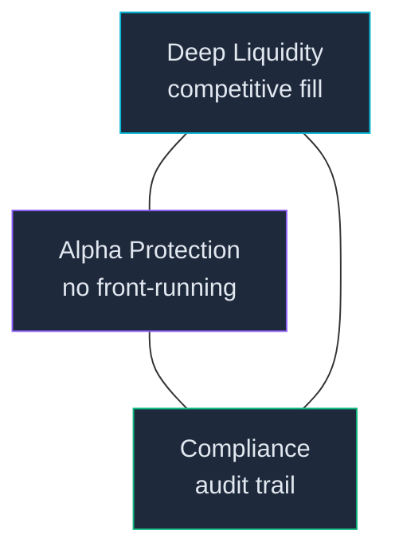
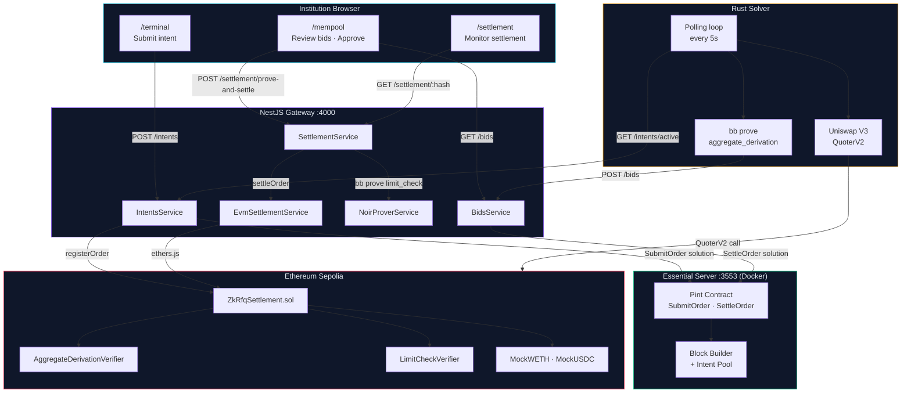
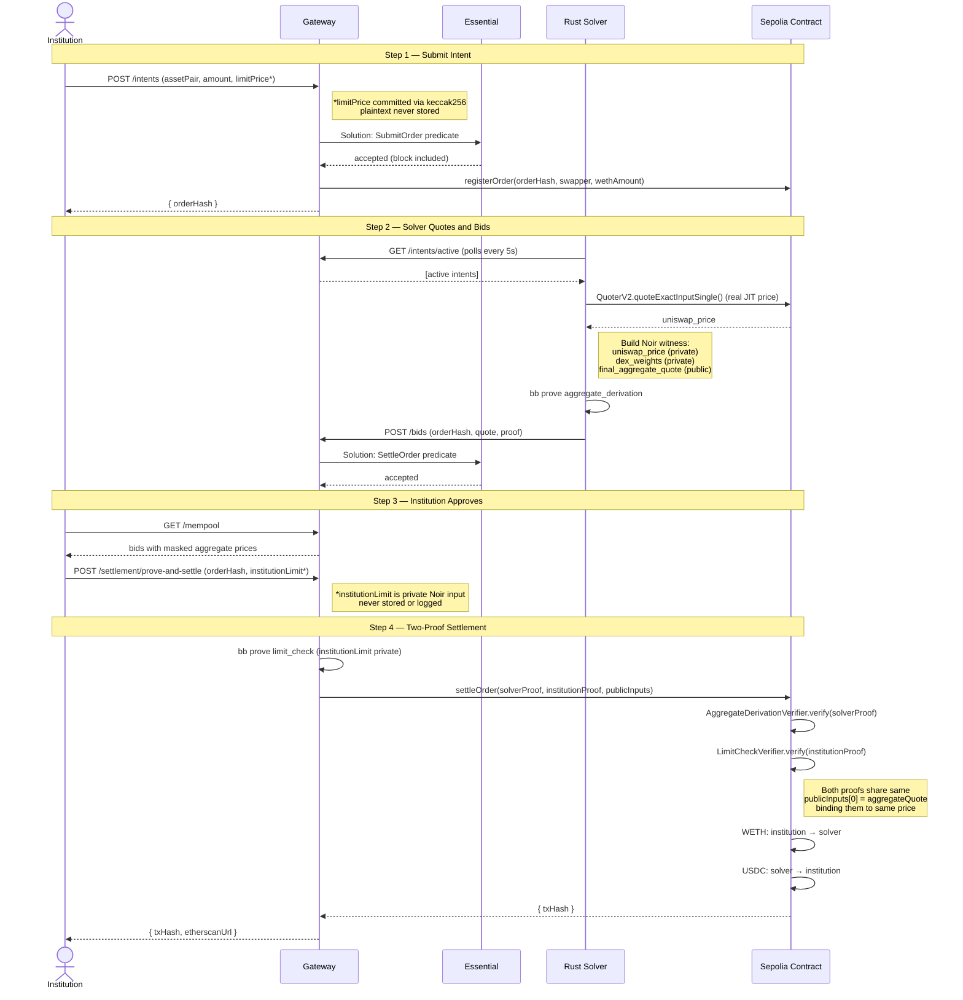
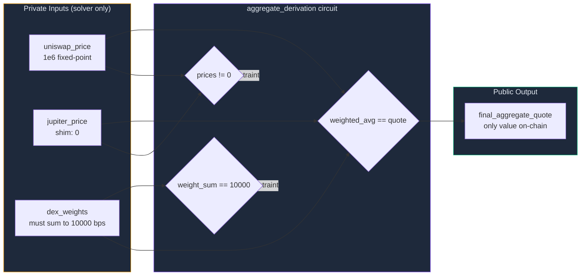
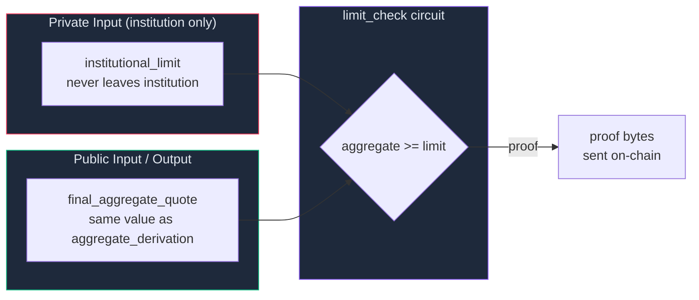
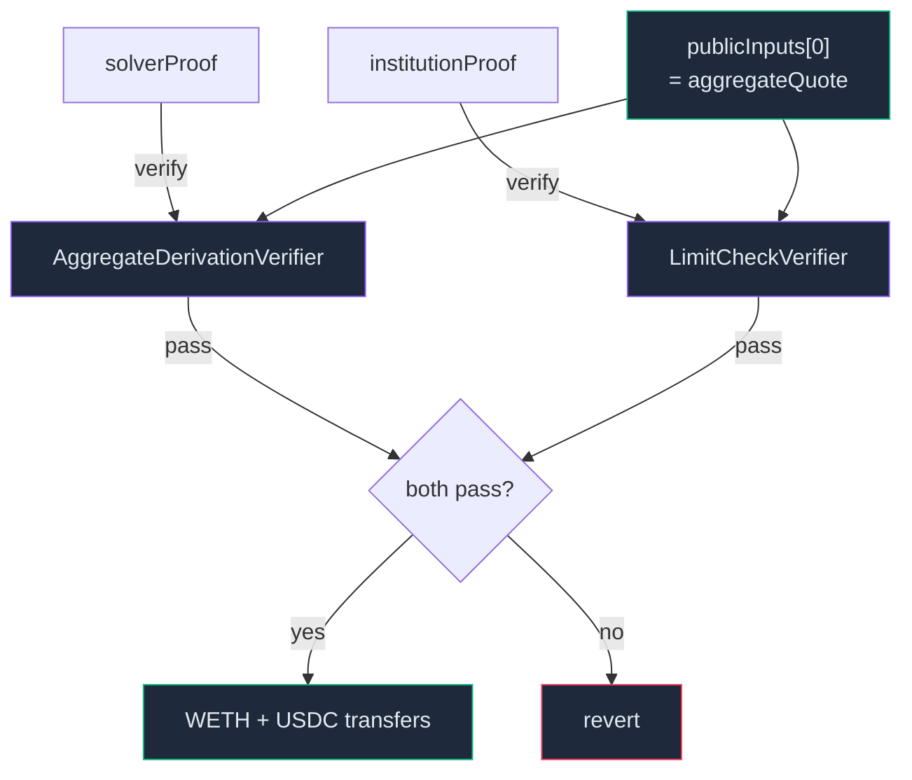
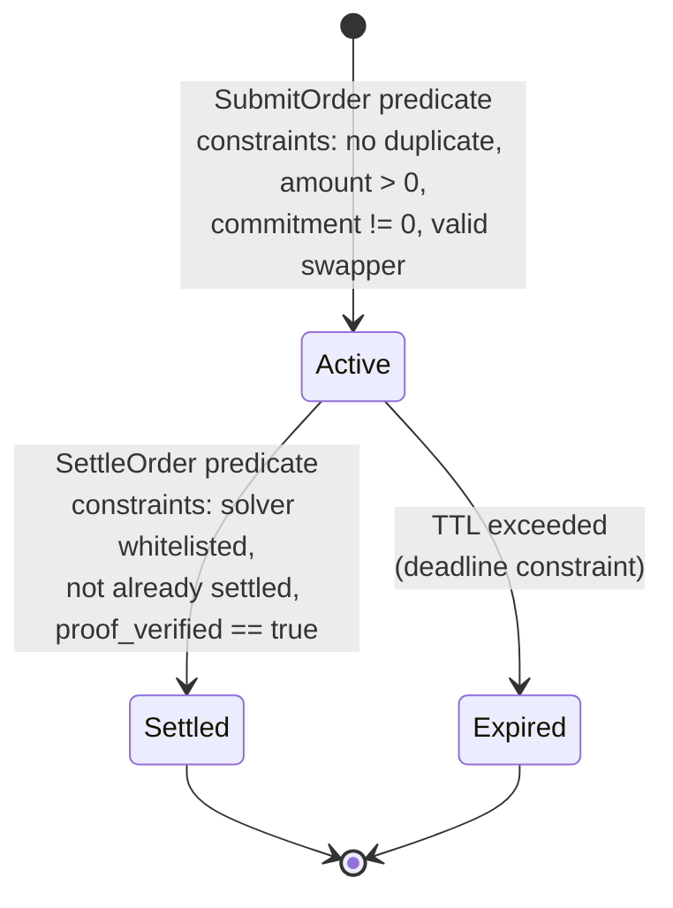

# ZK-RFQ Sovereign Gateway

> A self-hosted, zero-knowledge Request-for-Quote system for institutional block trading — resolving the alpha leakage trilemma without sacrificing liquidity access or compliance.

---

## Table of Contents

1. [The Problem](#1-the-problem)
2. [The Solution](#2-the-solution)
3. [Design Decisions](#3-design-decisions)
4. [System Architecture](#4-system-architecture)
5. [ZK Circuit Design](#5-zk-circuit-design)
6. [The Full Trade Flow](#6-the-full-trade-flow)
7. [Component Deep Dives](#7-component-deep-dives)
8. [Running the Demo](#8-running-the-demo)
9. [API Reference](#9-api-reference)
10. [Known Limitations & Roadmap](#10-known-limitations--roadmap)

> **New to the tech stack?** See [CONCEPTS.md](./CONCEPTS.md) for a plain-English explanation of ZK proofs, Essential Protocol, ERC-7683, Noir, and Barretenberg from first principles.

---

## 1. The Problem

When an institution wants to execute a large token swap on-chain, they face an irresolvable trilemma:



**You can pick two. Not three.**

| Approach | Liquidity | Alpha Protection | Compliance |
|---|---|---|---|
| Broadcast RFQ to market makers | ✅ | ❌ Front-running | ❌ Centralised intermediary |
| Private bilateral OTC | ✅ | ✅ | ❌ Counterparty trust required |
| On-chain AMM (Uniswap etc.) | ⚠️ MEV + slippage | ❌ Public mempool | ✅ |
| Centralised dark pool | ✅ | ✅ | ❌ Single point of failure |

The root issue: the moment you tell a counterparty your intent — the token, size, and direction — you've given them information they can act on before your trade executes. This is alpha leakage.

---

## 2. The Solution

ZK-RFQ resolves all three simultaneously using three primitives in combination:

| Primitive | What it solves |
|---|---|
| **ERC-7683 open intent standard** | Standardised order format attracts any solver — no proprietary API, competitive pricing |
| **Noir ZK proofs (two-circuit design)** | Solver proves price is honest without revealing routing; institution proves limit was met without revealing the limit |
| **Essential declarative protocol** | Self-hosted sovereign settlement — institution controls the infrastructure, no public mempool, business logic enforced by protocol |

---

## 3. Design Decisions

### Why two separate ZK circuits?

A single merged circuit would require the solver to have the institution's limit price as a private input — meaning the limit price would have to leave the institution's machine. Keeping them separate means neither party ever learns the other's private value. The solver proves pricing; the institution proves acceptance; neither sees the other's secret.

### Why Essential + Sepolia (dual-layer)?

Essential (private) stores the intent pool and enforces business logic (whitelist, TTL, no-double-settle) without a public mempool. Sepolia (public) handles only final ERC-20 transfers with on-chain ZK proof verification — providing the cryptographic audit trail that compliance requires. Two concerns, two layers.

### Why ERC-7683 instead of a proprietary format?

ERC-7683 is an emerging universal cross-chain intent standard. Conforming to it means any solver that supports ERC-7683 elsewhere can parse our intents without custom integration. It creates a permissionless competitive solver market around a public standard.

### Why Pint predicates instead of Solidity on Essential?

Essential's declarative model (Pint) lets you declare what valid terminal states look like — the protocol's constraint solver validates that a proposed state transition satisfies all rules before block inclusion. No re-entrancy bugs, no transaction ordering exploits, and competing solver support is built into the protocol's block builder auction.

### Why Rust for the solver?

The solver is latency-sensitive — it polls for intents, calls a live EVM RPC node, runs Barretenberg proof generation, and must submit under JIT freshness constraints. Rust gives native Alloy integration for `QuoterV2` calls, `tokio` for concurrent async operations, and minimal overhead vs. Node.js.

### Why keep `jupiter_price` as a zero shim?

The `aggregate_derivation` circuit was designed for two DEX sources. Rather than recompiling the circuit (which regenerates the Solidity verifier and requires a new deployment), we pass `jupiter_price = 0` and `dex_weights = [10000, 0]`. The circuit constraints still hold; the aggregate collapses to 100% Uniswap. Adding a second source later is a solver-only change.

### Why server-side `limit_check` proof generation (for now)?

In production, the `limit_check` proof should be generated client-side in the browser via `@noir-lang/noir_js` WASM — the limit price never leaving browser memory. For the testnet demo, server-side generation is used for simplicity. This is the highest-priority production gap.

---

## 4. System Architecture

### Component Topology



### Full Data Flow — One Trade End to End



---

## 5. ZK Circuit Design

Circuits live in `circuits/` as a Nargo workspace. Each is compiled with `nargo` and proven with Barretenberg (`bb`).

### `aggregate_derivation` — Solver's Privacy Guarantee

Proves the aggregate quote was honestly derived from real DEX prices without revealing which pools, prices, or routing weights were used.



**Constraints:**
1. `dex_weights[0] + dex_weights[1] == 10000` — prevents phantom routing claims
2. Both prices non-zero — guards against failed JIT fetches
3. `(uni * w[0] + jup * w[1]) / 10000 == final_aggregate_quote` — proves honest derivation

**Current shim:** `jupiter_price = 0`, `dex_weights = [10000, 0]` — collapses to 100% Uniswap V3 without recompiling the circuit.

---

### `limit_check` — Institution's Privacy Guarantee

Proves the aggregate quote meets the institution's secret limit price.



**The binding property:** Both circuits share the same `publicInputs[0] = final_aggregate_quote`. `ZkRfqSettlement` passes the identical array to both on-chain verifiers. A tampered aggregate fails `AggregateDerivationVerifier`; a mismatched value for `limit_check` fails `LimitCheckVerifier`.

---

### Two-Proof Binding on Chain



---

## 6. The Full Trade Flow

### Step 1 — Institution Submits Intent

The institution opens `/terminal`, connects MetaMask on Sepolia, and submits:
- Asset pair: `WETH/USDC`
- Amount: e.g. `1` WETH (submitted as `1e18`)
- Limit price: e.g. `2400` USDC/WETH minimum (submitted as `2400_000000` in 1e6)
- TTL: seconds the intent stays open (default 300)

**Gateway `IntentsService` actions:**
1. Generates a random `salt`, computes `keccak256(limitPrice || salt)` → `limitPriceCommitment`. Plaintext limit never persisted.
2. Encodes as `ERC-7683 CrossChainOrder` with `orderData.limitPriceCommitment` set.
3. Constructs an Essential `Solution` targeting `SubmitOrder` predicate, submits to Essential.
4. Calls `ZkRfqSettlement.registerOrder()` on Sepolia.
5. Returns `orderHash` to the frontend.

---

### Step 2 — Solver Quotes and Bids

The Rust solver polls `GET /intents/active` every 5 seconds. For each intent:

1. Calls `QuoterV2.quoteExactInputSingle()` on Sepolia — a real on-chain call, real price.
2. Builds the Noir witness: `uniswap_price` (private), `dex_weights = [10000, 0]` (private), `final_aggregate_quote` (public).
3. Runs `bb prove` on the `aggregate_derivation` circuit.
4. Posts `{ orderHash, finalAggregateQuote, proof, bidExpiry }` to the gateway.
5. Gateway builds a `SettleOrder` Essential solution and submits it; Essential validates and includes it.

---

### Step 3 — Institution Reviews and Approves

At `/mempool`, the institution sees the bid with the masked aggregate price and `Uniswap V3 · Sepolia` source badge. They enter their limit price and click **Approve & Settle**, calling `POST /settlement/prove-and-settle`.

---

### Step 4 — Gateway Generates Second Proof and Settles

1. Retrieves stored `solverProof` and `aggregateQuote`.
2. Fast-fails if `aggregateQuote < institutionLimit` before generating any proof.
3. `NoirProverService` runs `nargo execute` + `bb prove` on `limit_check`. `institutionLimit` is a private circuit input — written to a temp file, never stored.
4. Calls `ZkRfqSettlement.settleOrder()` with both proofs and the shared `publicInputs`.

---

### Step 5 — On-Chain Settlement

`ZkRfqSettlement.settleOrder()`:
1. Checks order registered and not yet settled.
2. `AggregateDerivationVerifier.verify(solverProof, publicInputs)` — rejects fabricated aggregates.
3. `LimitCheckVerifier.verify(institutionProof, publicInputs)` — rejects unmet limits.
4. Sets `settled[orderHash] = true` (replay protection).
5. Atomic token transfers: `WETH institution → solver`, `USDC solver → institution`.
6. Emits `OrderSettled` event.

---

## 7. Component Deep Dives

### Pint Contract (`predicates/`)



Three predicates:

| Predicate | Triggered by | Key constraints |
|---|---|---|
| `SubmitOrder` | Gateway (intent submission) | No duplicate orderHash, amount > 0, commitment != 0, swapper != 0 |
| `SettleOrder` | Gateway (solver bid accepted) | Order active, solver whitelisted, not settled, proof flag set |
| `GovernanceUpdateWhitelist` | Governance key holder | Caller == `governance_key` in Essential storage |

Essential validates all constraints before block inclusion. Application code cannot bypass them.

---

### Gateway (`gateway/src/`)

| Module | Responsibility |
|---|---|
| `IntentsService` | ERC-7683 order construction, limit price commitment, Essential `SubmitOrder` solution |
| `BidsService` | Essential `SettleOrder` solution from solver bid; dry-run via `checkSolution` |
| `SettlementService` | Solver proof storage, two-proof orchestration, EVM call coordination |
| `NoirProverService` | `nargo execute` + `bb prove` for `limit_check`; throws if toolchain missing |
| `EvmSettlementService` | ethers.js wallet management, `registerOrder` + `settleOrder` contract calls |
| `EssentialService` | Essential REST API wrapper — deploy contract, submit solutions, query state |

---

### Settlement Contract (`contracts/src/ZkRfqSettlement.sol`)

Key design choices:

- **Immutable verifiers** — `aggregateVerifier` and `limitVerifier` set at construction. Proof system upgrades require redeployment.
- **Shared `publicInputs`** — the same `bytes32[]` is passed to both verifiers, cryptographically binding both proofs to the same aggregate quote.
- **`ReentrancyGuard`** — both token transfers happen in one `nonReentrant` call; no callback-based reentrancy is possible.
- **`settled` mapping** — simple UTXO-style replay protection.
- **`Ownable` + `Pausable`** — emergency pause without destroying state.

---

### Rust Solver (`solver/src/`)

| File | Responsibility |
|---|---|
| `main.rs` | Polling loop, intent → bid flow, Noir witness assembly |
| `uniswap_quoter.rs` | Alloy `QuoterV2.quoteExactInputSingle()` on Sepolia |
| `noir_prover.rs` | `Prover.toml` generation, `nargo execute`, `bb prove`, proof parsing |
| `config.rs` | CLI args (Clap): Essential URL, gateway URL, Sepolia RPC, contract addresses |

---

### Frontend (`frontend/pages/`)

| Page | Role |
|---|---|
| `/` | Minimal landing — ConnectButton + "Open Terminal" |
| `/terminal` | Intent form — amount, limit price (hidden by default), TTL |
| `/mempool` | Live intent pool — bids, aggregate prices, approve & settle |
| `/settlement` | Essential block ticker, per-order status, Sepolia tx hash + Etherscan link |

API calls are proxied via `pages/api/[...path].ts` → `localhost:4000`. Wallet uses RainbowKit + Wagmi, locked to Sepolia.

---

## 8. Running the Demo

### Prerequisites

| Tool | Version | Install |
|------|---------|---------|
| Node.js | ≥ 18 | [nodejs.org](https://nodejs.org) |
| Rust | ≥ 1.75 | `curl --proto '=https' --tlsv1.2 -sSf https://sh.rustup.rs \| sh` |
| Foundry | latest | `curl -L https://foundry.paradigm.xyz \| bash && foundryup` |
| Docker | any | [docker.com](https://docker.com) |
| Nargo | 0.32.0 | `noirup -v 0.32.0` |
| Barretenberg (`bb`) | 0.55.0 | `bbup -v 0.55.0` |

> **Nargo and bb are required for real on-chain settlement.** Without them, proofs are mocked and the on-chain verifier will reject them.

---

### Step 1 — Clone and install

```bash
git clone <repo-url>
cd zk-rfq
(cd gateway && npm install)
(cd frontend && npm install)
(cd solver && cargo build --release)
(cd contracts && forge install)
```

### Step 2 — Deploy contracts to Sepolia

```bash
export SEPOLIA_RPC_URL=https://eth-sepolia.g.alchemy.com/v2/YOUR_KEY
export DEPLOYER_PRIVATE_KEY=0x...

cd contracts
forge script script/Deploy.s.sol \
  --rpc-url $SEPOLIA_RPC_URL \
  --private-key $DEPLOYER_PRIVATE_KEY \
  --broadcast
```

Copy the five printed addresses into `gateway/.env`:

```env
SEPOLIA_RPC_URL=https://eth-sepolia.g.alchemy.com/v2/YOUR_KEY
GATEWAY_PRIVATE_KEY=0x...

SETTLEMENT_CONTRACT=0x...
MOCK_WETH_ADDRESS=0x...
MOCK_USDC_ADDRESS=0x...
AGGREGATE_VERIFIER_ADDRESS=0x...
LIMIT_VERIFIER_ADDRESS=0x...

QUOTER_V2_ADDRESS=0xEd1f6473345F45b75F8179591dd5bA1888cf2FB3
ESSENTIAL_URL=http://localhost:3553
CIRCUITS_PATH=../../circuits
```

> Deploy script mints 100 MockWETH to your wallet and 1,000,000 MockUSDC to the solver. No real money required.

### Step 3 — Start Essential

```bash
docker compose up -d
docker compose ps   # wait for "healthy"

cd predicates && pint build
cd ../solver && cargo run -- --deploy
```

### Step 4 — Approve token spend

```bash
# Institution approves WETH
cast send $MOCK_WETH_ADDRESS \
  "approve(address,uint256)" $SETTLEMENT_CONTRACT 100000000000000000000 \
  --rpc-url $SEPOLIA_RPC_URL --private-key $INSTITUTION_PRIVATE_KEY

# Solver approves USDC
cast send $MOCK_USDC_ADDRESS \
  "approve(address,uint256)" $SETTLEMENT_CONTRACT 1000000000000 \
  --rpc-url $SEPOLIA_RPC_URL --private-key $SOLVER_PRIVATE_KEY
```

### Step 5 — Start all services

**Terminal 1 — Gateway:**
```bash
cd gateway && npm run start:dev
```

**Terminal 2 — Solver:**
```bash
cd solver && cargo run --release -- \
  --sepolia-rpc-url $SEPOLIA_RPC_URL \
  --mock-weth-address $MOCK_WETH_ADDRESS \
  --mock-usdc-address $MOCK_USDC_ADDRESS \
  --solver-address $SOLVER_ADDRESS
```

**Terminal 3 — Frontend:**
```bash
cd frontend && npm run dev
```

### Step 6 — Demo walkthrough

1. Open `http://localhost:3000` → click **Open Terminal** → connect MetaMask on Sepolia
2. At `/terminal`: enter amount `1`, limit price `2400`, click **Submit Intent**
3. Watch solver terminal: real Uniswap V3 quote → Noir proof generated → bid submitted
4. At `/mempool`: find your intent → enter limit price → click **Approve & Settle**
5. At `/settlement?orderHash=0x...`: watch Essential blocks tick → Sepolia tx hash appears → click Etherscan link

---

## 9. API Reference

### Intents

| Method | Path | Body | Description |
|--------|------|------|-------------|
| `POST` | `/intents` | `{ assetPair, amount, limitPrice, swapperAddress, ttlSeconds }` | Submit intent. `amount` in wei (1e18), `limitPrice` in 1e6. |
| `GET` | `/intents/active` | — | Active non-expired intents. Polled by solvers. |
| `GET` | `/intents/:orderHash` | — | Get intent by hash. |

### Bids

| Method | Path | Body | Description |
|--------|------|------|-------------|
| `POST` | `/bids` | `{ orderHash, solverAddress, finalAggregateQuote, proof, bidExpiry }` | Solver submits ZK-masked bid. |
| `GET` | `/bids/:orderHash` | — | All bids for an intent. |

### Settlement

| Method | Path | Body | Description |
|--------|------|------|-------------|
| `POST` | `/settlement/prove-and-settle` | `{ orderHash, institutionLimit }` | Institution approves. Gateway generates proof + calls `settleOrder`. |
| `POST` | `/settlement/approve` | `{ orderHash, institutionProof, publicInputs }` | Pre-generated proof path (future client-side WASM). |
| `GET` | `/settlement/:orderHash` | — | Settlement status — returns `{ status, txHash, blockNumber }`. |
| `GET` | `/balances/:address` | — | MockWETH + MockUSDC balances on Sepolia. |

### Health

| Method | Path | Description |
|--------|------|-------------|
| `GET` | `/health` | Gateway + Essential connectivity |
| `GET` | `/health/essential-block` | Latest Essential block number |

---

## 10. Known Limitations & Roadmap

| Area | Current state | Planned fix |
|---|---|---|
| **Proof generation** | `limit_check` runs server-side — limit price leaves institution | Client-side `@noir-lang/noir_js` WASM in browser |
| **Single token pair** | WETH/USDC only | Parameterise token addresses; deploy additional Uniswap V3 pools |
| **Single solver** | One Rust solver daemon | Whitelist multiple solver addresses; Essential block builder handles competition natively |
| **No EIP-712 signing** | Intents not wallet-signed — gateway could submit on institution's behalf | Add `eth_signTypedData` on `CrossChainOrder` struct |
| **No order cancellation** | Intents expire via TTL only | Add `CancelOrder` Pint predicate + `DELETE /intents/:hash` |
| **Static governance key** | Single EOA controls solver whitelist | Multi-sig or DAO-controlled `governance_key` |
| **Centralised Essential** | Single Docker node | Essential roadmap: decentralised node network; API is identical |
| **Sepolia only** | Not audited for mainnet | Security audit → mainnet deployment |
